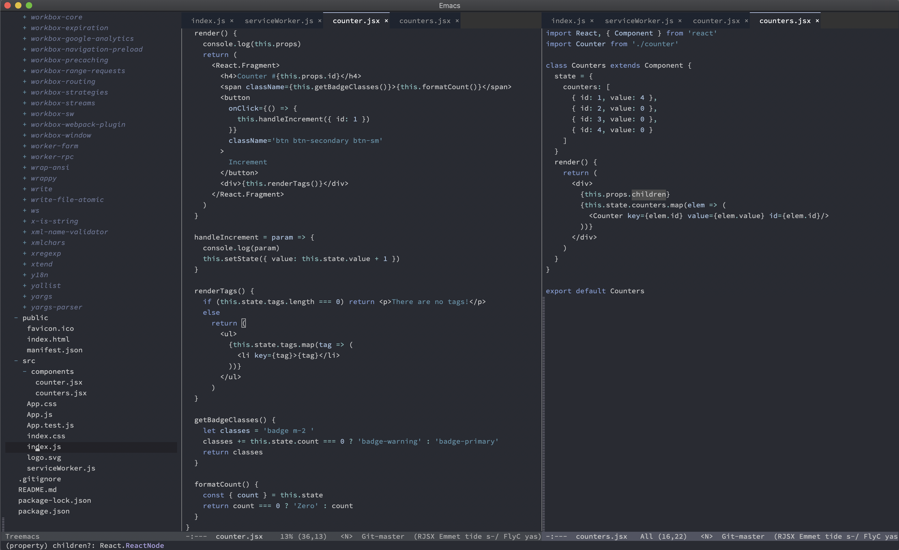

<h3 align="center">Wilmersdorf Emacs Theme</h3>
<hr/>


<p align="center">
  
</p>

<p align="center">
<a href="https://github.com/ianpan870102/wilmersdorf-emacs-theme"></a>
<a href="https://www.gnu.org/licenses/gpl-3.0"></a>
<a href="https://github.com/sindresorhus/awesome"></a>
</p>

<p align="center">An Emacs theme with dark subtle syntax highlighting</p>

<p align="center">Inspired by Monochrome, Spacemacs Dark, Ariake Dark, and Raiju</p>

<br/>
<br/>

#### Note: This theme is now featured in the [doom-themes](https://github.com/hlissner/emacs-doom-themes) package as doom-wilmersdorf

#### Installation

##### Option 1. Manual install

Download `wilmersdorf-theme.el` and put it under `~/.emacs.d/themes/`, then add these 2 lines to your `init.el`:

```
(add-to-list 'custom-theme-load-path "~/.emacs.d/themes/")
(load-theme `wilmersdorf t)
```
##### Option 2. MELPA

Install the `doom-themes` package from MELPA, and load the `doom-wilmersdorf` theme.

#### Screenshots: Emacs 26 on macOS





Copyright© 2018 Ian Y.E. Pan

This program is free software: you can redistribute it and/or modify it under the terms of the GNU General Public License as published by the Free Software Foundation, either version 3 of the License, or (at your option) any later version.

This program is distributed in the hope that it will be useful, but WITHOUT ANY WARRANTY; without even the implied warranty of MERCHANTABILITY or FITNESS FOR A PARTICULAR PURPOSE. See the GNU General Public License for more details.

You should have received a copy of the GNU General Public License along with this program. If not, see https://www.gnu.org/licenses/.
